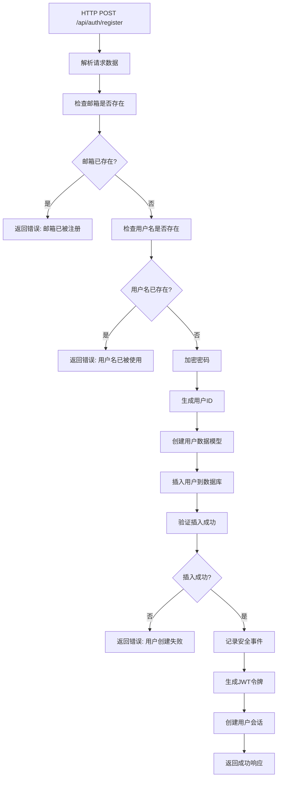

# QuantConsole 用户注册系统数据库写入流程详解

## 📋 概述

本文档详细解释了 QuantConsole 用户注册系统如何将用户数据写入数据库的完整流程，包括数据验证、密码加密、数据库操作、安全日志记录等各个环节。

## 🏗️ 系统架构

### 技术栈
- **后端框架**: Rust + Actix-Web
- **数据库**: MySQL 8.0+
- **ORM**: Sea-ORM
- **认证**: JWT + bcrypt
- **迁移工具**: Sea-ORM Migration

### 相关文件结构
```
backend/
├── src/
│   ├── handlers/auth.rs          # HTTP 请求处理器
│   ├── services/auth.rs          # 业务逻辑服务
│   ├── models/user.rs            # 用户数据模型
│   └── main.rs                   # 应用程序入口
├── migration/
│   └── src/
│       └── m20231201_000001_create_users_table.rs  # 数据库迁移
└── .env                          # 环境配置
```

## 🔄 注册流程详解

### 第1步：HTTP 请求接收
**文件**: `src/handlers/auth.rs`

```rust
pub async fn register(
    req: HttpRequest,
    auth_service: web::Data<Arc<AuthService>>,
    request: web::Json<RegisterRequest>,
) -> Result<HttpResponse>
```

**流程**:
1. 接收 POST 请求到 `/api/auth/register`
2. 解析 JSON 请求体为 `RegisterRequest` 结构
3. 提取客户端信息（IP地址、User-Agent）
4. 调用 `AuthService::register` 方法

**请求数据结构**:
```rust
#[derive(Debug, Deserialize)]
pub struct RegisterRequest {
    pub email: String,           // 用户邮箱
    pub password: String,        // 明文密码
    pub username: String,        // 用户名
    pub first_name: Option<String>,  // 名字（可选）
    pub last_name: Option<String>,   // 姓氏（可选）
}
```

### 第2步：数据验证
**文件**: `src/services/auth.rs`

#### 2.1 邮箱唯一性检查
```rust
// 检查邮箱是否已存在
if User::find()
    .filter(user::Column::Email.eq(&request.email))
    .one(&self.db)
    .await?
    .is_some()
{
    return Err(anyhow::anyhow!("邮箱已被注册"));
}
```

**SQL 等价语句**:
```sql
SELECT * FROM users WHERE email = '用户邮箱' LIMIT 1;
```

#### 2.2 用户名唯一性检查
```rust
// 检查用户名是否已存在
if User::find()
    .filter(user::Column::Username.eq(&request.username))
    .one(&self.db)
    .await?
    .is_some()
{
    return Err(anyhow::anyhow!("用户名已被使用"));
}
```

**SQL 等价语句**:
```sql
SELECT * FROM users WHERE username = '用户名' LIMIT 1;
```

### 第3步：密码加密
```rust
// 创建用户
let password_hash = self.hash_password(&request.password)?;

fn hash_password(&self, password: &str) -> Result<String> {
    Ok(hash(password, DEFAULT_COST)?)  // 使用 bcrypt 加密
}
```

**加密过程**:
- 使用 bcrypt 算法
- 默认成本因子（通常为 12）
- 自动生成盐值
- 生成60字符的哈希字符串

### 第4步：用户数据准备
```rust
let password_hash = self.hash_password(&request.password)?;
let user_id = uuid::Uuid::new_v4().to_string();  // 生成唯一 ID
let now = Utc::now().with_timezone(&chrono::FixedOffset::east_opt(0).unwrap());

let user = user::ActiveModel {
    id: Set(user_id.clone()),                    // UUID 主键
    email: Set(request.email.clone()),           // 邮箱
    username: Set(request.username.clone()),     // 用户名
    password_hash: Set(password_hash),           // 加密后的密码
    first_name: Set(request.first_name.clone()), // 名字
    last_name: Set(request.last_name.clone()),   // 姓氏
    role: Set("user".to_string()),               // 默认角色
    is_active: Set(true),                        // 账户状态
    is_email_verified: Set(false),               // 邮箱验证状态
    is_two_factor_enabled: Set(false),           // 双因素认证状态
    created_at: Set(now),                        // 创建时间
    updated_at: Set(now),                        // 更新时间
    ..Default::default()                         // 其他字段使用默认值
};
```

### 第5步：数据库写入
#### 5.1 插入用户记录
```rust
// 插入用户
let _inserted_user = user.insert(&self.db).await?;
```

**SQL 等价语句**:
```sql
INSERT INTO users (
    id, email, username, password_hash, first_name, last_name,
    role, is_active, is_email_verified, is_two_factor_enabled,
    created_at, updated_at
) VALUES (
    'uuid-string', 'email@example.com', 'username', '$2b$12$...hash...',
    'First', 'Last', 'user', true, false, false,
    '2025-07-24 12:30:52+00:00', '2025-07-24 12:30:52+00:00'
);
```

#### 5.2 验证插入成功
```rust
// 验证插入是否成功 - 从数据库重新查询用户
let user = User::find_by_id(&user_id)
    .one(&self.db)
    .await?
    .ok_or_else(|| anyhow::anyhow!("用户创建失败"))?;
```

**SQL 等价语句**:
```sql
SELECT * FROM users WHERE id = 'uuid-string';
```

### 第6步：安全日志记录
```rust
// 记录安全事件
self.log_security_event(
    user.id.clone(),
    "register".to_string(),
    "用户注册".to_string(),
    ip_address.clone(),
    user_agent.clone(),
    "low".to_string(),
).await?;
```

**写入 security_events 表**:
```sql
INSERT INTO security_events (
    id, user_id, event_type, description, ip_address,
    user_agent, severity, created_at
) VALUES (
    'event-uuid', 'user-uuid', 'register', '用户注册',
    '127.0.0.1', 'Mozilla/5.0...', 'low', '2025-07-24 12:30:52+00:00'
);
```

### 第7步：JWT令牌生成
```rust
// 生成令牌
let (access_token, refresh_token) = self.generate_tokens(&user).await?;
```

**令牌内容**:
- **Access Token**: 1小时有效期，包含用户基本信息
- **Refresh Token**: 7天有效期，用于刷新访问令牌

### 第8步：会话创建
```rust
// 创建会话
self.create_session(&user, &refresh_token, ip_address, user_agent).await?;
```

**写入 user_sessions 表**:
```sql
INSERT INTO user_sessions (
    id, user_id, refresh_token, ip_address, user_agent,
    expires_at, created_at, updated_at, last_accessed_at, is_active
) VALUES (
    'session-uuid', 'user-uuid', 'refresh-token', '127.0.0.1',
    'Mozilla/5.0...', '2025-07-31 12:30:52+00:00',
    '2025-07-24 12:30:52+00:00', '2025-07-24 12:30:52+00:00',
    '2025-07-24 12:30:52+00:00', true
);
```

## 🗃️ 数据库表结构

### users 表
```sql
CREATE TABLE users (
    id CHAR(36) NOT NULL PRIMARY KEY,           -- UUID 主键
    email VARCHAR(255) NOT NULL UNIQUE,         -- 邮箱（唯一）
    username VARCHAR(50) NOT NULL UNIQUE,       -- 用户名（唯一）
    password_hash VARCHAR(255) NOT NULL,        -- bcrypt 密码哈希
    first_name VARCHAR(100),                    -- 名字
    last_name VARCHAR(100),                     -- 姓氏
    avatar VARCHAR(255),                        -- 头像 URL
    is_email_verified BOOLEAN NOT NULL DEFAULT false,      -- 邮箱验证状态
    is_two_factor_enabled BOOLEAN NOT NULL DEFAULT false,  -- 双因素认证状态
    two_factor_secret VARCHAR(255),             -- 双因素认证密钥
    role VARCHAR(20) NOT NULL DEFAULT 'user',   -- 用户角色
    is_active BOOLEAN NOT NULL DEFAULT true,    -- 账户状态
    email_verification_token VARCHAR(255),      -- 邮箱验证令牌
    email_verification_expires_at TIMESTAMP WITH TIME ZONE, -- 验证令牌过期时间
    password_reset_token VARCHAR(255),          -- 密码重置令牌
    password_reset_expires_at TIMESTAMP WITH TIME ZONE,     -- 重置令牌过期时间
    last_login_at TIMESTAMP WITH TIME ZONE,     -- 最后登录时间
    last_login_ip VARCHAR(45),                  -- 最后登录IP
    created_at TIMESTAMP WITH TIME ZONE NOT NULL, -- 创建时间
    updated_at TIMESTAMP WITH TIME ZONE NOT NULL  -- 更新时间
);

-- 索引
CREATE INDEX idx_users_email ON users(email);
CREATE INDEX idx_users_username ON users(username);
```

### user_sessions 表
```sql
CREATE TABLE user_sessions (
    id CHAR(36) NOT NULL PRIMARY KEY,
    user_id CHAR(36) NOT NULL,
    refresh_token TEXT NOT NULL,
    ip_address VARCHAR(45) NOT NULL,
    user_agent TEXT NOT NULL,
    location VARCHAR(255),
    expires_at TIMESTAMP WITH TIME ZONE NOT NULL,
    is_active BOOLEAN NOT NULL DEFAULT true,
    created_at TIMESTAMP WITH TIME ZONE NOT NULL,
    updated_at TIMESTAMP WITH TIME ZONE NOT NULL,
    last_accessed_at TIMESTAMP WITH TIME ZONE NOT NULL,
    FOREIGN KEY (user_id) REFERENCES users(id) ON DELETE CASCADE
);
```

### security_events 表
```sql
CREATE TABLE security_events (
    id CHAR(36) NOT NULL PRIMARY KEY,
    user_id CHAR(36) NOT NULL,
    event_type VARCHAR(50) NOT NULL,
    description TEXT NOT NULL,
    ip_address VARCHAR(45) NOT NULL,
    user_agent TEXT NOT NULL,
    severity VARCHAR(20) NOT NULL,
    created_at TIMESTAMP WITH TIME ZONE NOT NULL,
    FOREIGN KEY (user_id) REFERENCES users(id) ON DELETE CASCADE
);
```

## 🔒 安全特性

### 1. 密码安全
- **加密算法**: bcrypt
- **成本因子**: 12（默认）
- **盐值**: 自动生成
- **密码强度**: 前端可添加验证规则

### 2. 数据验证
- **邮箱唯一性**: 数据库约束 + 应用层检查
- **用户名唯一性**: 数据库约束 + 应用层检查
- **数据类型**: Sea-ORM 自动验证

### 3. 审计日志
- **操作记录**: 每次注册都记录到 security_events
- **IP追踪**: 记录注册时的IP地址
- **设备信息**: 记录User-Agent信息

### 4. 会话管理
- **JWT令牌**: 无状态认证
- **刷新机制**: 7天有效期的刷新令牌
- **会话追踪**: 数据库存储会话信息

## 🚦 错误处理

### 常见错误及处理
1. **邮箱已存在**: 返回 400 错误
2. **用户名已存在**: 返回 400 错误
3. **数据库连接失败**: 返回 500 错误
4. **密码加密失败**: 返回 500 错误
5. **用户创建失败**: 返回 500 错误并回滚

### 错误日志
所有错误都会记录到应用日志中，便于调试和监控。

## 🔧 配置说明

### 环境变量 (.env)
```env
# 数据库配置
DATABASE_URL=mysql://root@localhost:3306/quantconsole?charset=utf8mb4

# JWT 密钥
JWT_SECRET=your-super-secret-jwt-key-change-this-in-production

# 服务器配置
HOST=127.0.0.1
PORT=8080
```

### 依赖关系 (Cargo.toml)
```toml
[dependencies]
sea-orm = { version = "0.12", features = ["runtime-tokio-rustls", "sqlx-mysql"] }
bcrypt = "0.15"
uuid = { version = "1.0", features = ["v4"] }
jsonwebtoken = "9.3"
chrono = { version = "0.4", features = ["serde"] }
anyhow = "1.0"
```

## 📈 性能考虑

### 数据库优化
1. **索引**: 邮箱和用户名字段建立索引
2. **连接池**: 使用数据库连接池
3. **事务**: 使用数据库事务确保数据一致性

### 密码加密
- bcrypt 成本因子设置为合理值（12）
- 平衡安全性和性能

## 🔄 流程图



## 📝 总结

QuantConsole 的注册系统采用了多层安全防护：

1. **数据验证层**: 确保数据唯一性和完整性
2. **加密层**: 使用 bcrypt 安全存储密码
3. **审计层**: 记录所有注册活动
4. **会话层**: 管理用户认证状态
5. **错误处理层**: 优雅处理各种异常情况

这种设计确保了用户数据的安全性、系统的可靠性和良好的用户体验。
